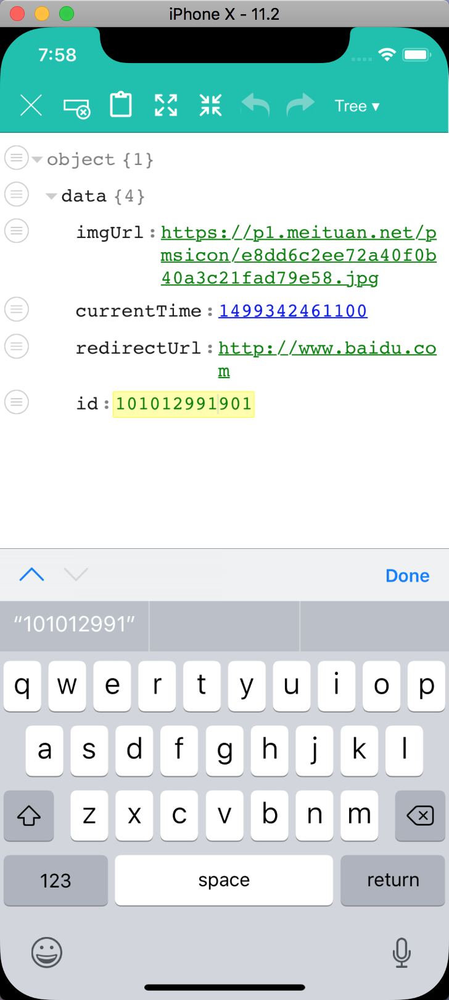
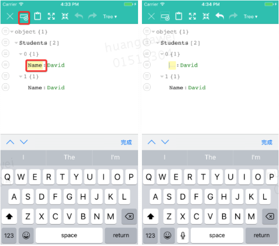
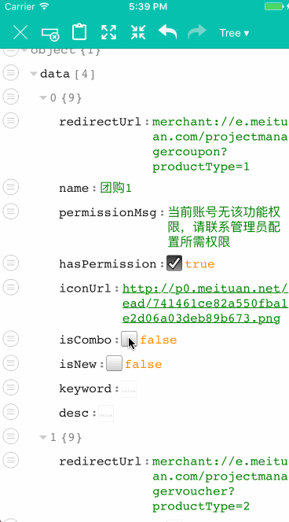
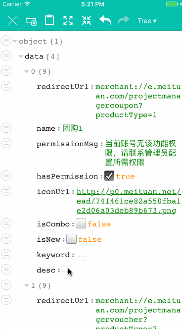

## JSONEditer

如果说产品告诉你他有个需求要求在手机上能编辑服务端返回的json，你是不是认为他疯了，我们可以用：“手机屏幕这么小，打字，选中文字这么麻烦，怎么编辑”类似的理由怼他。但是如果这个需求是我们自己的一个技术需求中的小功能，那我们就不得不考虑怎么做一个在手机上方便修改json文本的编辑器了。

详细可以看一下我的博客：https://hdw09.github.io/2017/12/25/%E4%BB%8EJSONEditer%E7%9C%8BH5%E4%B8%8Enative%E4%BA%A4%E4%BA%92/

#### JSONEditer实现过程

第一种映入的想法就是既然JSON是有结构的文本，那边就按照其结构展开它，每个节点可以单独编辑，这样就规避了手动按压拖动的选择方式。还有结构化之后我们可以对每个节点添加插入、删除、修改类型等快捷菜单，这样在添加内容时就少了很多打字的麻烦。想到这里时，突然意识的这样的功能我见过，于是去我的start过的github项目找了一了下，有一个jsoneditor的js项目   <https://github.com/josdejong/jsoneditor> 只要弄个webView加载一下本地的html资源不就有了一个jsonEditer了吗？结果。。。。。。在手机上完全看不清啊，完全点不中呀！还是要改一下原来的CSS文件，让这个js库可以支持手机屏幕。稿了半天终于好看一点了,当然也适配了iPhoneX



之后我添加了一些我认为有用的方便用户操作的功能并处理了一些h5与native交互的问题

* 选择某个元素后，点击菜单中的清空功能，可以直接删除里面的文本

  

* 如果你从别的地方粘贴了一点文本，可以点击菜单中的粘贴功能，直接填入内容，这里涉及到系统粘贴版的功能，我使用native代码实现（主要是不知道js怎么搞的）具体很简单，可以看代码

  

* 处理键盘弹出的动作，这个花费了做这个小工具的2/5的时间，要好好说到一下
  首先这个问题是这样的，这个页面的标题并不是navtive的titleBar，是Html中的一个DIV
  要想一个DIV固定在屏幕中，就得设置他的position属性为fixed
  but，在iOS webview中fixed的属性控制的元素当键盘弹出时会回归到标准流中，失去定位的特点,这就很麻烦，因为如果titlebar被顶上去了，上面的清空和粘贴等快捷功能都用不了了,如下图：

  

  我开始觉得这应该是很普遍的问题，做前端的人应该早就整理好了解决办法，但是在网上搜还真没有从native层面去解决的方案
  我解决的思路是，既然跟键盘弹出有关，那就先监听键盘的通知，屏幕向上自动滚动肯定是scrollview的问题，那么就在键盘弹出时禁止webview的scroll滚动，这么做后发现不行，因为我禁用滚动导致手动拖动功能失效，后来突然有了灵感可以在键盘弹出时将scrollView的代理设置为自己，由自己来控制器滚动：

  ```objective-c
  - (void)viewWillAppear:(BOOL)animated
  {
      @weakify(self);
      [[[[[NSNotificationCenter defaultCenter] rac_addObserverForName:UIKeyboardWillShowNotification object:nil]
         takeUntil:[self rac_signalForSelector:@selector(viewWillDisappear:)]]
        deliverOnMainThread]
       subscribeNext:^(NSNotification *notification) {
           @strongify(self);
           self.oldScrollDelegate = self.webView.scrollView.delegate;
           self.oldOffset = self.webView.scrollView.contentOffset;
           self.webView.scrollView.delegate = self;
            
           [self.webView stringByEvaluatingJavaScriptFromString:@"jsonediter_keyboard_show();"];
       }];
       
      [[[[[NSNotificationCenter defaultCenter] rac_addObserverForName:UIKeyboardWillHideNotification object:nil]
         takeUntil:[self rac_signalForSelector:@selector(viewWillDisappear:)]]
        deliverOnMainThread]
       subscribeNext:^(NSNotification *notification) {
           @strongify(self);
           self.webView.scrollView.delegate = self.oldScrollDelegate;
            
       }];
  }
  - (void)scrollViewDidScroll:(UIScrollView *)scrollView
  {
      scrollView.contentOffset = self.oldOffset;
  }
  ```

  但是这么做后有个新问题，就是在屏幕下面点击的编辑框，会被升起的键盘盖住，瞬间心灰意冷，这是个死锁的问题啊（既不能让webview的srcollview自动滚动，又得让它滚动以使下面的内容不被盖住）。
  but  突然就有了灵感，既然在native上死锁，那将另一部分在js中实现呢？对呀，可以把键盘升起的通知传给js，让他把当前编辑框所做的位置提高就好了啊
  上面代码中[self.webView stringByEvaluatingJavaScriptFromString:@"jsonediter_keyboard_show();"];就是做这个事情，js部分的代码如下：

  ```javascript
  function getWhatScrollElement() {
      if (document.getElementsByClassName('jsoneditor-tree')[0]) {
          return document.getElementsByClassName('jsoneditor-tree')[0];
      } else if (document.getElementsByClassName('ace_scrollbar')[0]) {
          return document.getElementsByClassName('ace_scrollbar')[0]
      } else {
          return undefined;
      }
  }
   function getElementTop(element) {
      var actualTop = element.offsetTop;
  　　var current = element.offsetParent;
  　　while (current !== null) {
          actualTop += current.offsetTop;
  　　　　　current = current.offsetParent;
  　　}
      var scrollTop = 0;
      if (getWhatScrollElement()) {
          scrollTop = getWhatScrollElement().scrollTop;
      }
  　　return actualTop - scrollTop;
  }
  function screenHeight() {
      if (document.body.clientWidth == 750) {
          return 1334;
      } else if (document.body.clientWidth == 1080) {
          return 1920;
      } else {
          return 1000;
      }
  }
   function jsonediter_keyboard_show() {
       if (getWhatScrollElement()) {
          var topOffset = getElementTop(document.activeElement);
          if (topOffset > screenHeight() / 2 ) {
              getWhatScrollElement().scrollTop += (screenHeight() / 2 - 50)
          }
       }
   }
  ```

  然后就好了啊，上图：

  
